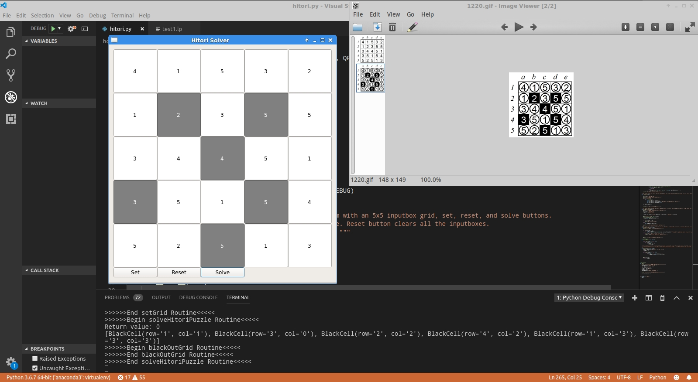

Author: Jaesub Shim
Email:jashim@ttu.edu
Date: 5 July, 2019
Version: 0.1
Requried: clingo, mkatoms, PyQt5
Description: 

This program solves Hitori Puzzle using Anser Set Programming. It uses PyQt5 for UI to let user input numbers, 
and it passes on the user input along with ASP logic file onto ASP solver through system call to get the puzzle solution, 
which is displayed on GUI. It requires dependencies, such as clingo, mkatoms, and PyQt5, and has been tested to work on Ubuntu Linux 14.04. 
The GUI is built using PyQt5 and styling used is "Fusion", which may or may not display correctly in other systems.

To sovle a Hitori puzzle with the program, supply numbers to the input boxes and click on the set button to finish input.
Then, click on solve button to solve the puzzle. Reset button can be used to clear the input box grid. 
The program will display a message box if no answer can be found.

The program will not work and display the error messages with no solutions if required dependencies are not met or not installed.

